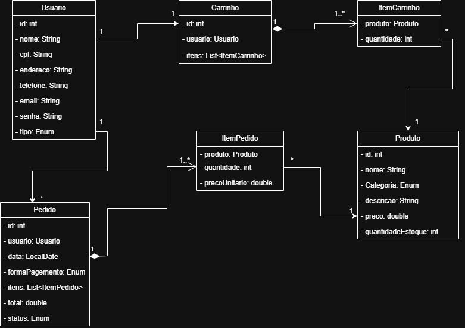

# South_shop 💻

O sistema consiste em uma plataforma de vendas com dois níveis de acesso: administrador e usuário comum.

 📝 **Administradores têm permissão para cadastrar e gerenciar produtos, além de controlar os usuários da plataforma.**

🛒 **Usuários comuns podem navegar pelos produtos, adicionar ou remover itens do carrinho, visualizar o histórico de compras e acessar um resumo completo do pedido antes da confirmação.**

Os itens adicionados ao carrinho permanecem salvos até serem removidos manualmente pelo usuário ou até a conclusão da compra. Somente após a confirmação do "pagamento" o pedido é registrado no histórico do usuário e os itens são efetivamente removidos do carrinho.

